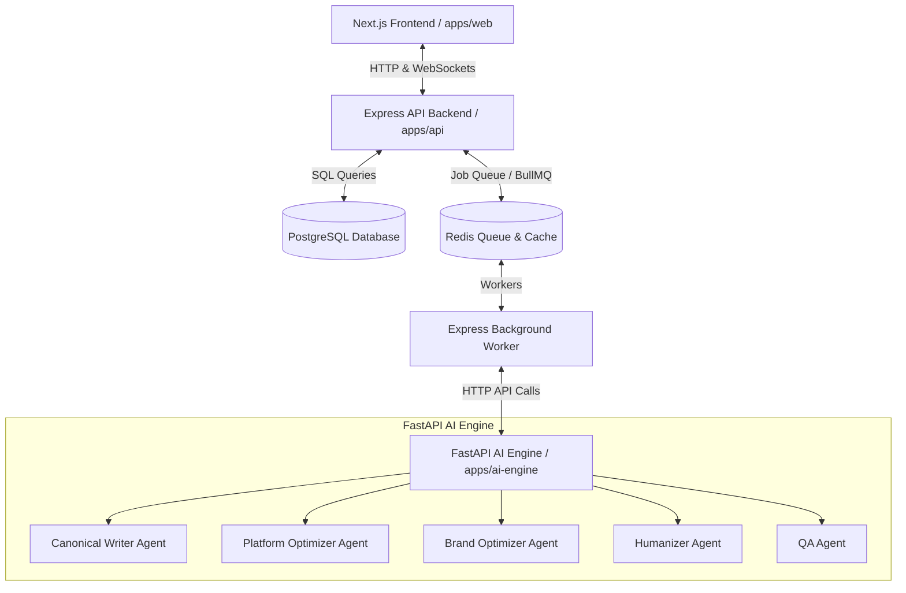

# M-CAP Platform — System Audit & Technical Overview

Welcome to the **M-CAP Platform** (Multi-Channel Content Generation & Optimization Platform). This repository contains a production-grade, multi-agent AI workspace designed to generate, refine, and humanize content across different formats while strictly maintaining organization and department-level brand profiles.

---

## 🏗️ System Architecture & Services

The project is structured as a **Turborepo Monorepo** containing three core microservices, shared libraries, and third-party integrations:



### 📁 Directory Layout

*   **[`apps/web`](file:///c:/Users/Sameer%20Thakur/M-CAP%20Plateform/apps/web)**: Next.js 14 Web Application (App Router, TailwindCSS, Zustand, React Query, Socket.io client).
*   **[`apps/api`](file:///c:/Users/Sameer%20Thakur/M-CAP%20Plateform/apps/api)**: Express.js Backend Service orchestrating the database, workspaces, websocket communication, and BullMQ background workers.
*   **[`apps/ai-engine`](file:///c:/Users/Sameer%20Thakur/M-CAP%20Plateform/apps/ai-engine)**: FastAPI Python microservice running the LLM orchestrations, agent actions, and prompt compilations.
*   **[`packages/shared`](file:///c:/Users/Sameer%20Thakur/M-CAP%20Plateform/packages/shared)**: Shared Typescript interfaces (`types/`) used to enforce data contracts between the web frontend and API backend.
*   **[`migrations`](file:///c:/Users/Sameer%20Thakur/M-CAP%20Plateform/migrations)**: Raw SQL schema migrations deploying the database tables and relational indexes.

---

## 🗄️ Database Schema & Workspace Hierarchy

The relational schema implements a rich multi-tenant hierarchy designed for large enterprise settings:

```
Organization
 └── Departments
      └── Teams (Department Members)
           └── Projects
                └── Campaigns
                     └── Content Requests
                          ├── Agent Executions (logs)
                          └── Artifacts (final generated assets)
```

### Key Database Tables

1.  **`organizations`**: Master tenant records managing plans (`free`, `pro`, `enterprise`), regional timezones, and system settings.
2.  **`users`**: Profiles linked to organizations with roles (`owner`, `admin`, `editor`, `writer`, `reviewer`, `analyst`, `viewer`).
3.  **`departments`**: Sub-units within organizations containing custom members, teams, and heads.
4.  **`brand_profiles`**: Multidimensional tone scales (formality, technicality, humor, confidence, etc.), preferred terms, banned phrases, key messages, value propositions, and compliance notes.
5.  **`projects`**: Top-level workspace categories to group work.
6.  **`campaigns`**: Collaborative timelines within a department and project.
7.  **`content_requests`**: Source inputs (topic, target platforms, templates, structures, keywords, settings) that drive the AI generation pipeline.
8.  **`agent_executions`**: Audits and caches LLM usage metrics, input/output tokens, durations, and output verification hashes.
9.  **`artifacts`**: Individual versioned drafts generated at each step of the optimization workflow (e.g. platform adapted, brand-aligned, humanized, QA reviewed).

---

## 🤖 AI Multi-Agent Pipeline

The core engine is driven by a series of LLM agents acting sequentially to refine content requests:

```
[Content Request] 
      │
      ▼
1. Canonical Writer   ──► Generates baseline thought leadership content
      │
      ▼
2. Platform Optimizer ──► Tailors format & tone to target platform (LinkedIn, X, Blog, etc.)
      │
      ▼
3. Brand Optimizer    ──► Aligns terminology, mission statements, and tone bounds
      │
      ▼
4. Humanizer          ──► Softens AI writing signatures and improves readability flow
      │
      ▼
5. QA Agent           ──► Performs compliance checks and issues quality metrics
      │
      ▼
[Final Artifact]
```

### Agent Specifications

*   **Canonical Writer**: Constructs the main narrative using structures like thesis, debate, story-telling, or data-driven layouts.
*   **Platform Optimizer**: Reforms the baseline draft into platform-appropriate standards (e.g., adding line breaks for LinkedIn, creating X/Twitter threads, or expanding details for blogs).
*   **Brand Optimizer**: Scans generated content against the `brand_profile` to replace banned phrases, introduce key vocabulary, and enforce compliance constraints.
*   **Humanizer**: Adjusts writing cadence and transitions based on low, medium, or aggressive intensity settings.
*   **QA Agent**: Flags compliance issues, scores content (readability, brand fit, platform fit), and formats final reports.

---

## ⚡ Job Processing & Queue Architecture

The backend handles heavy AI processing asynchronously using **BullMQ** and **Redis**:

*   When a user initiates a content request, a generation job is queued.
*   The **Express background worker** picks up the job and coordinates sequential API requests to the Python AI engine.
*   **Step-by-step progress** is pushed to the client using **WebSockets** (Socket.io) so that users can watch agents refine the content in real time.
*   If an execution step crashes or fails, the database registers a detailed log under `agent_executions` and flags the failure on `content_requests`.

---

## 🚀 Local Setup & Orchestration

The workspace includes a complete Docker layout to configure all dependencies in one click.

### Requirements
*   Node.js >= 18.0
*   Docker & Docker Compose
*   OpenAI and Anthropic API keys

### Setup Instructions

1.  **Configure environment variables**:
    ```bash
    cp .env.example .env
    # Edit the .env file with your DATABASE_URL, REDIS_URL, and API keys.
    ```
2.  **Spin up containers**:
    ```bash
    docker-compose up -d --build
    ```
    This launches:
    *   **Postgres** on `localhost:5432`
    *   **Redis** on `localhost:6379`
    *   **Next.js Client** on `localhost:3000`
    *   **Express API** on `localhost:4000`
    *   **AI Engine** on `localhost:8000`

3.  **Run migrations and start in Dev mode (outside Docker)**:
    ```bash
    npm install
    npm run dev
    ```

---
